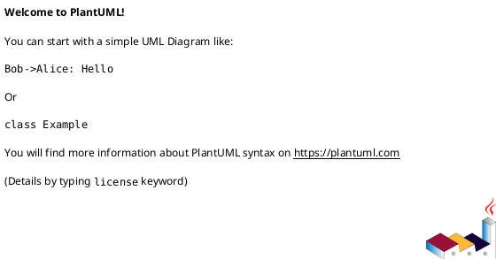

# 📊 HƯỚNG DẪN SỬ DỤNG CÁC FILE PLANTUML

> Tài liệu hướng dẫn xem và biên tập các sơ đồ UML cho Hệ thống Quản lý Ngân hàng

---

## 🎯 PHIÊN BẢN MỚI - TỐI ƯU HÓA

**✅ Tất cả file đã được RÚT GỌN và SỬA LỖI CÚ PHÁP!**

---

## 📁 CẤU TRÚC THƯ MỤC (Mới)

```
diagrams/
├── usecase.puml                 # Use Case (~50 dòng)
├── class.puml                   # Class Diagram (~80 dòng)
├── er.puml                      # ER Diagram (~70 dòng)
├── component.puml               # Component (~35 dòng)
├── deployment.puml              # Deployment (~40 dòng)
├── sequence-chuyen-khoan.puml   # Chuyển khoản (~30 dòng)
├── sequence-vay-von.puml        # Vay vốn (~40 dòng)
├── sequence-tra-no.puml         # Trả nợ (~30 dòng)
├── activity-dao-han.puml        # Đáo hạn (~40 dòng)
├── activity-xu-ly-vay.puml      # Xử lý vay (~50 dòng)
├── credit-score-flow.puml       # Credit Score (~45 dòng)
├── state-loan.puml              # State Loan (~20 dòng)
├── state-credit-score.puml      # State Score (~40 dòng)
└── GUIDE.md                     # Hướng dẫn chi tiết
```

---

## 🚀 CÁCH SỬ DỤNG

### Phương pháp 1: PlantUML Online Editor (Đơn giản nhất)

1. **Truy cập:** https://www.plantuml.com/plantuml/uml/
2. **Copy nội dung file `.puml`** vào editor
3. **Xem kết quả** ngay lập tức
4. **Download:** 
   - PNG: Chất lượng cao cho báo cáo
   - SVG: Vector, có thể scale
   - PDF: In ấn

### Phương pháp 2: Visual Studio Code Extension

#### Cài đặt Extension:
```
1. Mở VS Code
2. Vào Extensions (Ctrl+Shift+X)
3. Tìm "PlantUML" by jebbs
4. Click Install
```

#### Xem sơ đồ:
```
1. Mở file .puml
2. Nhấn Alt+D (hoặc Ctrl+Shift+P → "PlantUML: Preview Current Diagram")
3. Sơ đồ hiển thị bên cạnh code
```

#### Export:
```
1. Ctrl+Shift+P
2. Gõ "PlantUML: Export"
3. Chọn định dạng: PNG, SVG, PDF, EPS
```

### Phương pháp 3: PlantUML Desktop App

#### Download:
- **Windows/Mac/Linux:** http://plantuml.com/download

#### Sử dụng:
```bash
# Tạo PNG từ file
java -jar plantuml.jar diagram.puml

# Tạo SVG
java -jar plantuml.jar -tsvg diagram.puml

# Xử lý cả folder
java -jar plantuml.jar diagrams/*.puml
```

### Phương pháp 4: IntelliJ IDEA Plugin

```
1. Settings → Plugins
2. Tìm "PlantUML integration"
3. Install và restart
4. Right-click file .puml → "View PlantUML Diagram"
```

---

## 📊 MÔ TẢ CÁC SƠ ĐỒ

### 1. Use Case Diagram (`01-usecase-diagram.puml`)

**Mục đích:** Hiển thị các chức năng hệ thống theo từng vai trò người dùng

**Actors:**
- 👤 **Khách hàng:** Quản lý tài khoản, giao dịch, tiết kiệm, vay vốn
- 💼 **Giao dịch viên:** Mở tài khoản, nạp/rút tiền, kích hoạt thẻ
- 🏦 **Cán bộ tín dụng:** Thẩm định, phê duyệt khoản vay
- 👨‍💼 **Quản lý chi nhánh:** Quản lý nhân viên, báo cáo
- 👨‍💻 **Quản trị viên:** Cấu hình hệ thống, quản lý người dùng

**Use cases chính:**
- Quản lý tài khoản (14 use cases)
- Giao dịch (8 use cases)  
- Tiết kiệm (4 use cases)
- Vay vốn (6 use cases)
- Quản lý thẻ (3 use cases)

### 2. Class Diagram (`02-class-diagram.puml`)

**Mục đích:** Hiển thị cấu trúc các class và mối quan hệ

**Đặc điểm:**
- ✅ **Đầy đủ tất cả fields** theo schema SQL
- ✅ Hiển thị Primary Key (PK), Foreign Key (FK), Unique Key (UK)
- ✅ Kiểu dữ liệu chính xác (decimal(18,2), enum, timestamp...)
- ✅ Methods cho từng class
- ✅ Relationships đầy đủ với cardinality
- ✅ Notes giải thích công thức và quy trình

**Các nhóm Class:**
1. **Organization:** Branch, Role, Employee
2. **Customer:** Customer, CreditScore
3. **Account:** AccountType, Account, Card
4. **Transaction:** TransactionType, Transaction
5. **Savings:** SavingsInterestRate, SavingsDeposit, SavingsTransaction
6. **Loan:** LoanType, LoanInterestRate, Loan, LoanPaymentSchedule, LoanPayment, CollateralType, Collateral

### 3. ER Diagram (`03-er-diagram.puml`)

**Mục đích:** Hiển thị cấu trúc database với các bảng và relationships

**Đặc điểm:**
- ✅ Tất cả fields theo schema
- ✅ Constraints: PK, FK, UK, CHECK
- ✅ Indexes
- ✅ Cardinalities chi tiết
- ✅ Notes về ràng buộc dữ liệu

**Số lượng bảng:** 19 bảng
- Organization: 3 bảng
- Customer: 2 bảng
- Account: 4 bảng
- Transaction: 2 bảng
- Savings: 3 bảng
- Loan: 7 bảng

### 4. Sequence Diagrams (`sequence/*.puml`)

**Mục đích:** Hiển thị luồng tương tác giữa các đối tượng theo thời gian

#### 01. Đăng ký tài khoản
- Actors: Khách hàng
- Flow: Đăng ký → Validate → Tạo customer → Tạo account → SMS/Email

#### 02. Chuyển khoản
- Actors: Khách hàng
- Flow: Kiểm tra TK → Transaction lock → Trừ/Cộng tiền → Commit → SMS
- **Đặc biệt:** Minh họa ACID properties và concurrency control

#### 03. Gửi tiết kiệm
- Actors: Khách hàng
- Flow: Chọn kỳ hạn → Kiểm tra số dư → Trừ tiền → Tạo sổ → Tính lãi

#### 04. Vay vốn (Đầy đủ nhất)
- Actors: Khách hàng, Cán bộ tín dụng
- Flow 6 bước:
  1. Đăng ký khoản vay
  2. Thẩm định hồ sơ
  3. Tra cứu CIC
  4. Thẩm định tài sản
  5. Phê duyệt
  6. Giải ngân
- **Tính toán:** LTV, DTI, Monthly payment

#### 05. Trả nợ
- 3 trường hợp:
  1. Trả tự động (auto-debit)
  2. Trả thủ công
  3. Nợ quá hạn (với lãi phạt)

### 5. Activity Diagrams (`activity/*.puml`)

**Mục đích:** Hiển thị quy trình nghiệp vụ với các điều kiện và nhánh

#### 01. Rút tiền
- Swimlanes: Khách hàng, GDV, Hệ thống
- Kiểm tra: CMND, Số dư, Hạn mức, Trạng thái TK
- **Decision points:** 5 điểm kiểm tra

#### 02. Đáo hạn tiết kiệm
- Tự động chạy hàng ngày
- **3 lựa chọn:**
  - Rút tiền về TK
  - Tái tục chỉ gốc
  - Tái tục gốc + lãi
- Auto-renew sau 7 ngày

#### 03. Xử lý vay vốn (Hoàn chỉnh)
- **6 giai đoạn:**
  1. Kiểm tra hồ sơ
  2. Thẩm định (song song: DTI, CIC, Tài sản)
  3. Quyết định
  4. Ký hợp đồng
  5. Giải ngân
  6. Thiết lập trả nợ tự động

### 6. Component Diagram (`04-component-diagram.puml`)

**Mục đích:** Hiển thị kiến trúc hệ thống theo layers

**Layers:**
1. **Presentation:** Web App, Mobile App, Admin Dashboard
2. **API Gateway:** Authentication, Rate Limiter
3. **Business Logic:** 
   - Account Management
   - Customer Management
   - Savings Management
   - Loan Management
   - Admin Services
4. **Data Access:** Repositories
5. **Database:** MySQL + Redis Cache
6. **External Services:** NAPAS, CIC, SMS, Email, eKYC
7. **Background:** Scheduled Jobs, Notifications

### 7. Deployment Diagram (`05-deployment-diagram.puml`)

**Mục đích:** Hiển thị cấu hình triển khai production

**Infrastructure:**
- **Load Balancer:** Nginx (SSL, Load balancing)
- **Web Servers:** 2x Ubuntu (Node.js, Express)
- **App Servers:** 2x Ubuntu (Business logic)
- **DB Cluster:** Master + 2 Replicas (MySQL 8.0)
- **Cache:** Redis Cluster (16GB RAM)
- **Monitoring:** Prometheus + Grafana + ELK
- **Storage:** AWS S3
- **Backup:** Daily + Weekly + Monthly

**Specs chi tiết:**
```
Web Servers: 4 cores, 8GB RAM, 50GB SSD
App Servers: 8 cores, 16GB RAM, 100GB SSD
DB Master: 16 cores, 32GB RAM, 500GB SSD RAID 10
DB Replicas: 8 cores, 16GB RAM, 500GB SSD
Cache: 4 cores, 16GB RAM, 50GB SSD
```

---

## 🎨 TIPS VÀ TRICKS

### 1. Thay đổi màu sắc

```plantuml
' Định nghĩa màu
!define CUSTOMER_COLOR #FFE6E6
!define ADMIN_COLOR #E6FFE6

:Actor: as Customer <<Customer>> CUSTOMER_COLOR
```

### 2. Thêm Icons

```plantuml
' Sử dụng Unicode
👤 Khách hàng
💼 Nhân viên
🏦 Ngân hàng
💰 Tiền
📊 Báo cáo
```

### 3. Skin themes

```plantuml
' Thêm vào đầu file
!theme cerulean-outline
' Hoặc: aws-orange, blueprint, carbon-gray...
```

### 4. Export với độ phân giải cao

```bash
# PNG với DPI 300
java -DPLANTUML_LIMIT_SIZE=8192 -jar plantuml.jar -tpng -SdefaultFontSize=14 diagram.puml
```

### 5. Tạo nhiều diagrams trong 1 file



---

## 🔧 TROUBLESHOOTING

### Lỗi: "Syntax Error"
✅ **Giải pháp:** Kiểm tra dấu ngoặc, dấu chấm phẩy, từ khóa PlantUML

### Lỗi: "File too complex"
✅ **Giải pháp:** 
```bash
java -DPLANTUML_LIMIT_SIZE=16384 -jar plantuml.jar diagram.puml
```

### Lỗi: Font Unicode không hiển thị
✅ **Giải pháp:** Cài font hỗ trợ Unicode (Noto Sans, Arial Unicode)

### Preview không cập nhật trong VS Code
✅ **Giải pháp:** 
- Reload window (Ctrl+Shift+P → "Reload Window")
- Hoặc tắt/mở lại preview

---

## 📚 TÀI LIỆU THAM KHẢO

### PlantUML Official
- **Website:** http://plantuml.com
- **Docs:** http://plantuml.com/guide
- **Examples:** http://real-world-plantuml.com

### Tutorials
- **Use Case:** http://plantuml.com/use-case-diagram
- **Class:** http://plantuml.com/class-diagram
- **Sequence:** http://plantuml.com/sequence-diagram
- **Activity:** http://plantuml.com/activity-diagram-beta

### UML Standards
- **OMG UML:** https://www.omg.org/spec/UML/
- **UML Basics:** https://www.uml-diagrams.org

---

## 💡 GỢI Ý SỬ DỤNG

### Cho Sinh viên
1. **Học UML:** Đọc kỹ các file để hiểu cách vẽ sơ đồ UML chuẩn
2. **Copy Template:** Sử dụng làm template cho đồ án của bạn
3. **Customize:** Thay đổi cho phù hợp với yêu cầu đề tài

### Cho Giảng viên
1. **Teaching Material:** Sử dụng trong bài giảng về UML
2. **Examples:** Ví dụ thực tế về hệ thống phức tạp
3. **Assignments:** Giao bài tập vẽ sơ đồ tương tự

### Cho Developer
1. **Documentation:** Document kiến trúc hệ thống
2. **Design:** Thiết kế trước khi code
3. **Communication:** Truyền đạt ý tưởng cho team

---

## 🔄 CẬP NHẬT

### Version 1.0 (27/10/2025)
- ✅ Tạo đầy đủ 10 file PlantUML
- ✅ Class Diagram đầy đủ theo schema SQL
- ✅ Sequence Diagrams cho 5 nghiệp vụ chính
- ✅ Activity Diagrams chi tiết với swimlanes
- ✅ Component và Deployment diagrams

### Planned Updates
- 🔜 State Machine Diagrams
- 🔜 Communication Diagrams
- 🔜 Timing Diagrams

---

## 📞 HỖ TRỢ

Nếu có vấn đề với các file PlantUML:

1. **Kiểm tra syntax:** Copy vào PlantUML Online để test
2. **Xem log:** Terminal sẽ hiển thị lỗi cụ thể
3. **Update PlantUML:** Đảm bảo dùng phiên bản mới nhất

---

## 📝 LƯU Ý

- ⚠️ **File size:** Một số diagram phức tạp có thể render chậm
- ⚠️ **Encoding:** Sử dụng UTF-8 để hiển thị tiếng Việt đúng
- ⚠️ **Export:** SVG giữ được chất lượng tốt nhất khi zoom
- ⚠️ **Print:** Sử dụng PDF cho in ấn báo cáo

---

**Chúc bạn thành công với dự án! 🎉**

